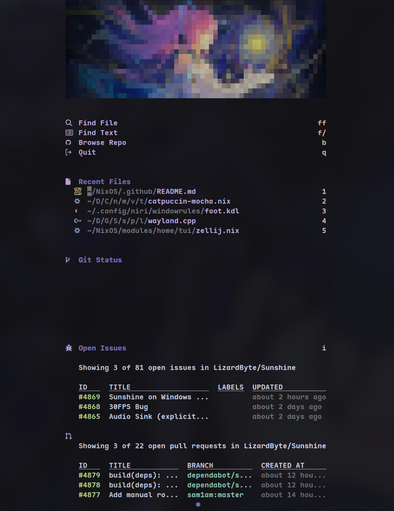
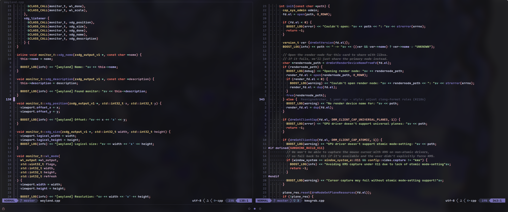
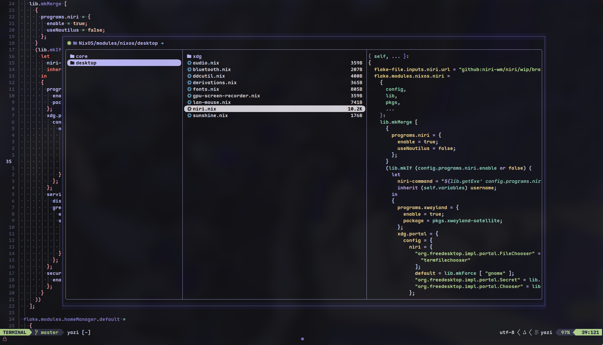
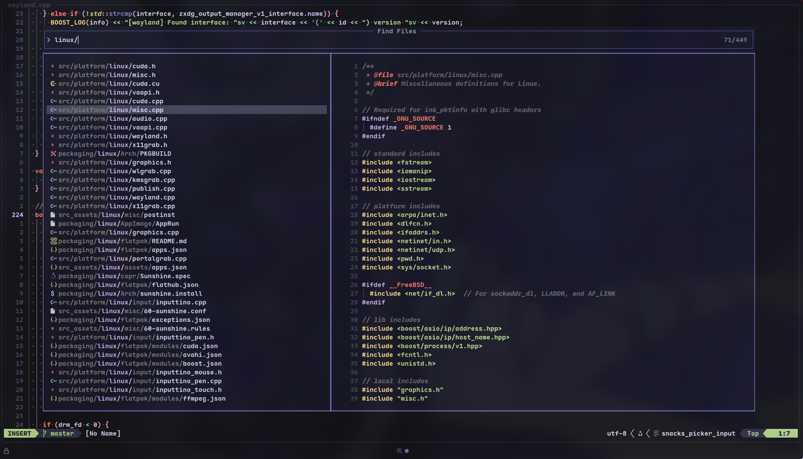
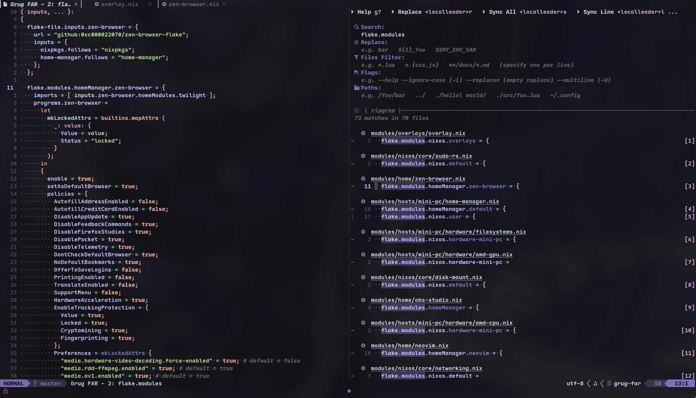
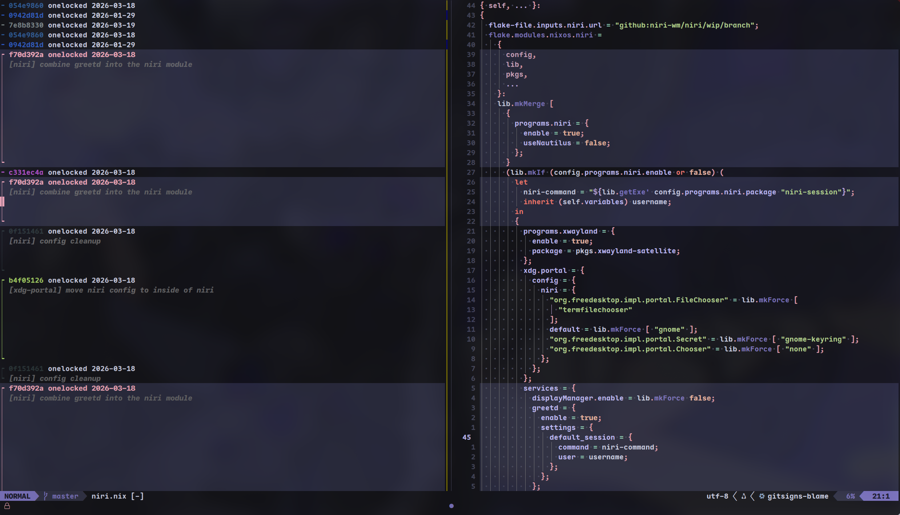

<div align="center">

# Vimmax
<br>

## Screenshots
<br>

**Dashboard**


<br>
<br>

**Editor**
<br>

<br>
|    |    |
|:-------:|:-------:|
|  |  |
|  |  |


</div>

# Run
```nix
nix run github:/onelocked/vimmax
```
# Installation

**Add vimmax as a flake input**
```nix
# In your flake.nix
inputs.vimmax.url = "github:onelocked/vimmax";
```

**NixOS or Home Manager**
```nix
# For NixOS
environment.packages = [
  inputs.vimmax.packages.${pkgs.stdenv.hostPlatform.system}.default
];

# For Home Manager
home.packages = [
  inputs.vimmax.packages.${pkgs.stdenv.hostPlatform.system}.default
];
```
